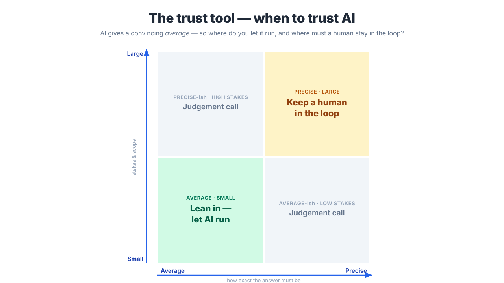

These are durable, tool-agnostic frameworks: they work regardless of which AI model you're using or which one comes out next quarter.

## The trust tool: when to trust AI

The core lens for the whole day: **Average / Precise × Small / Large.**

- AI excels at **average** answers over **small**, low-stakes work, so lean in.
- It gets dangerous on **precise** answers and **large**, high-stakes work, so keep a human in the loop.

This is what makes "where does a human stay in the loop?" an answerable question rather than a vibe. It comes from the free companion book, [*Conversation, Not Delegation*](https://michael-borck.github.io/conversation-not-delegation/). Start there to go deeper.

{fig-align="center"}

## DDCD: leading through the inevitable crisis

When an AI project hits trouble (and it will), work the problem: **Diagnose → Decide → Communicate → Document.** First ask whether it's a *technical*, *people*, *leadership*, or *ethical* crisis, as they need different responses.

## Scale / Pivot / Kill: the go/no-go call

At each gate, the honest question isn't "is it perfect?". It's whether the evidence justifies continuing. **Killing a project that isn't working, early, is success, not failure.** The cost of wrongly scaling is far higher than the cost of wrongly killing.

## Take-home references

::: {#handouts}
:::
