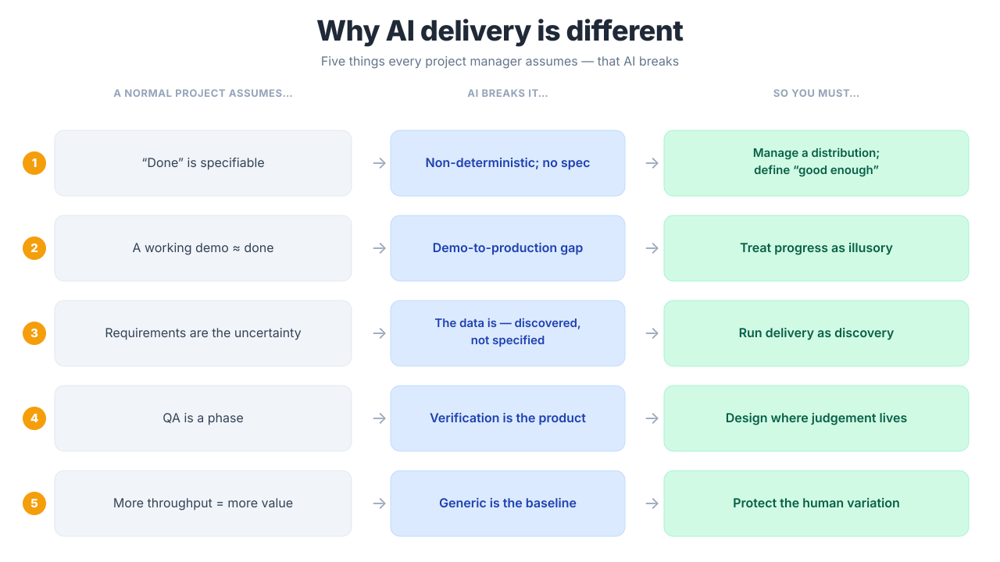

::::: {.hero}
::::: {.hero-grid}
::::: {.hero-copy}
::::: {.kicker}
AI Capability Lifecycle Series · Course 3
:::::
# AI in Delivery
::::: {.lead}
Leading projects that ship, without the predictable failures.
:::::
::::: {.hero-cta}
[Start before the day](before.qmd){.btn .btn-primary .btn-lg}
[See the workshop](workshop.qmd){.btn .btn-outline-primary .btn-lg}
:::::
:::::
::::: {.hero-visual}

:::::
:::::
:::::

Welcome. This is your companion site for the one-day **AI in Delivery** masterclass. Everything you need is here: what to read before the day, the workshop you'll work through, the frameworks you'll take home, and the RetailFlow team you'll interview.

<a class="card-tile" href="./before.html"><i class="bi bi-journal-text"></i>Before the dayThree short reads so you arrive ready.</a>
<a class="card-tile green" href="./workshop.html"><i class="bi bi-tools"></i>The workshopThree sprints on one real project.</a>
<a class="card-tile accent" href="./frameworks.html"><i class="bi bi-compass"></i>FrameworksThe tools you'll keep using Monday.</a>
<a class="card-tile violet" href="./team.html"><i class="bi bi-people"></i>Meet the teamInterview RetailFlow's leadership live.</a>

## The question you came to answer

> *Why is delivering an AI project different from delivering any other project?*

That's the spine of the day. The answer is **five things every project manager assumes, that AI breaks:**

{fig-align="center"}

Every PM tool you know still applies, but each one **bends** under these five forces. The day is about learning the bend.

## What you'll leave with

A **delivery design for a real AI project**, not a theory to apply later:

- Scoped objectives, data requirements, and a defined "good enough"
- A delivery roadmap with milestones and go/no-go gates
- A stakeholder plan and a human-in-the-loop checkpoint design
- A risk register and a pilot-to-production path

## How the day runs

| Time | Block |
|---|---|
| 9:00–10:30 | **Why AI is different**: the five differences + the trust tool |
| 11:00–12:30 | **Sprint 1: Scope it against reality** |
| 1:15–2:30 | **Sprint 2: Stakeholders & human-in-the-loop** |
| 3:00–4:00 | **Sprint 3: Roadmap, risk & the go/no-go call** |
| 4:00–4:30 | **The edge that's left to humans** + your action plan |

::: {.callout-note}
## Going deeper, on your terms
This course scaffolds the theory and points you to where to dig. The free companion resource, [*Conversation, Not Delegation*](https://michael-borck.github.io/conversation-not-delegation/), goes deeper on every idea here, including the **trust tool** for deciding when to rely on AI.
:::
